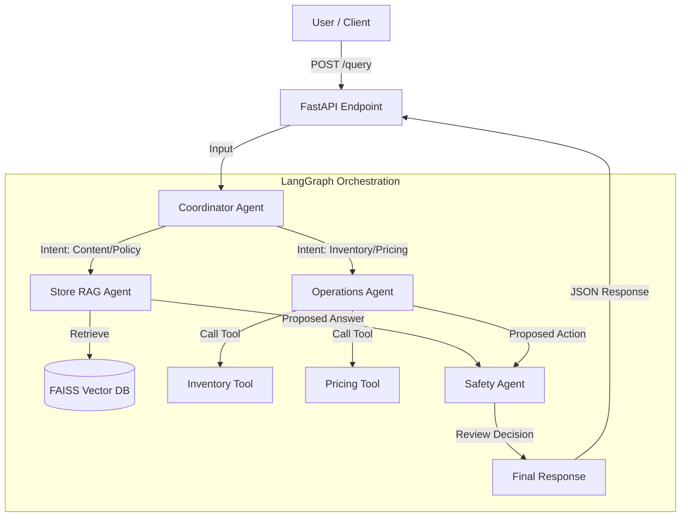

# Agentic AI Store Operations Manager

An intelligent backend system for managing store operations using a Multi-Agent architecture.
Built with **FastAPI**, **LangGraph**, **LangChain**, and **ChromaDB**.

## 🚀 Features

- **Multi-Agent Orchestration**:
  - **Coordinator**: Routes queries to specialists.
  - **Store RAG Agent**: Answers questions using Vector Retrieval (ChromaDB).
  - **Operations Agent**: Uses tools to check stock, analyze sales, and suggest pricing.
  - **Safety Agent**: Reviews all potentially harmful actions before approval.
- **Safety First**: Implements a "human-in-the-loop" style safety check where modification actions require review.
- **Tool Use**: Deterministic tools for inventory and pricing analysis.

## 🛠️ Architecture

Users interact via a REST API:



`User Input` -> `Coordinator` -> (`StoreRAG` OR `Operations`) -> `Safety` -> `Final Response`

## 📦 Tech Stack

- **Python 3.10+**
- **FastAPI**: Backend API.
- **LangGraph**: Agent orchestration state machine.
- **LangChain**: Tooling and LLM interface.
- **ChromaDB**: Vector database for store knowledge.
- **OpenAI GPT-4o**: Underlying LLM.

## 🏁 How to Run

1. **Clone the repository** (if not already done).
2. **Install dependencies**:
   ```bash
   pip install -r app/requirements.txt
   ```
   *Note: On Windows, you might need C++ build tools for `chromadb`.*
3. **Setup Environment**:
   Create a `.env` file in the root:
   ```env
   OPENAI_API_KEY=your_sk_key_here
   ```
4. **Run the Server**:
   ```bash
   python -m app.main
   ```
   OR
   ```bash
   uvicorn app.api:app --reload
   ```

## 🧪 API Usage

**Endpoint**: `POST /query`

**Example Request**:
```json
{
  "query": "Which products need restocking?"
}
```

**Example Response**:
```json
{
  "intent": "inventory",
  "agents_used": ["Coordinator", "Operations", "Safety"],
  "tools_called": ["check_low_stock"],
  "safety_decision": "APPROVED",
  "response": "..."
}
```
